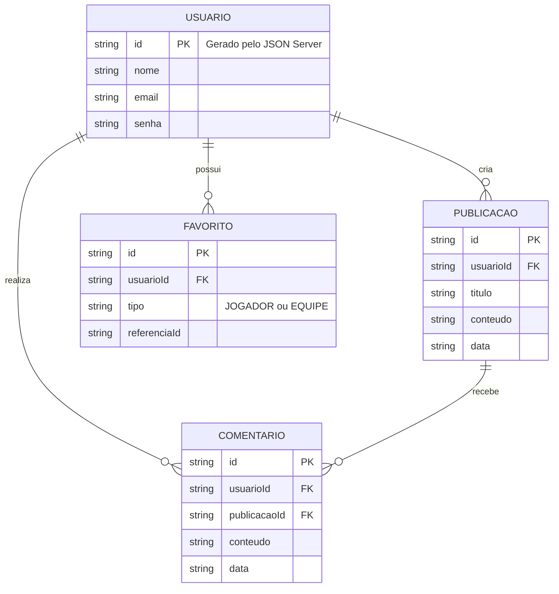

# 🛠️ Especificação Técnica (Tech Spec) - ClutchBR

Este documento detalha a arquitetura técnica, o modelo de dados e os contratos de API necessários para o funcionamento do sistema ClutchBR.

## 1. Modelo de Dados (Diagrama ER)

Abaixo está o Diagrama Entidade-Relacionamento (DER) que representa a estrutura do banco de dados simulado (`db.json`) e como as informações se conectam.



Os dados relacionados ao cenário competitivo, como jogadores, equipes, partidas e rankings, serão obtidos através da API pública do Counter-Strike.

## 2. Dicionário de Dados

Breve explicação das principais entidades:

- **Usuários:** Responsável por armazenar os dados necessários para autenticação e identificação dos usuários da comunidade.
  - `id`: Identificador único do usuário.
  - `nome`: Nome utilizado pelo usuário na plataforma.
  - `email`: E-mail utilizado para acesso à conta.
  - `senha`: Senha utilizada na autenticação.

- **Publicações:** Armazena os conteúdos criados pelos usuários na área da comunidade.
  - `id`: Identificador único da publicação.
  - `usuarioId`: Identifica o usuário responsável pela publicação.
  - `titulo`: Título da publicação.
  - `conteudo`: Texto da publicação.
  - `data`: Data em que a publicação foi criada.

- **Comentários:** Armazena os comentários realizados nas publicações.
  - `id`: Identificador único do comentário.
  - `usuarioId`: Usuário que realizou o comentário.
  - `publicacaoId`: Publicação relacionada ao comentário.
  - `conteudo`: Texto do comentário.
  - `data`: Data em que o comentário foi realizado.

- **Favoritos:** Armazena jogadores e equipes favoritados pelos usuários.
  - `id`: Identificador único do favorito.
  - `usuarioId`: Usuário que adicionou o favorito.
  - `tipo`: Define se o favorito é um jogador ou uma equipe.
  - `referenciaId`: Identificador do jogador ou equipe favoritado.

## 3. APIs Utilizadas

O ClutchBR utilizará duas fontes principais de dados:

### API Fake - JSON Server

O **JSON Server** será utilizado para simular uma API própria do sistema, armazenando dados relacionados aos usuários e à comunidade.

Principais endpoints:

- `GET /usuarios` - Retorna os usuários cadastrados.
- `POST /usuarios` - Cadastra um novo usuário.
- `GET /publicacoes` - Retorna as publicações.
- `POST /publicacoes` - Cria uma nova publicação.
- `GET /comentarios` - Retorna os comentários.
- `POST /comentarios` - Cria um novo comentário.
- `GET /favoritos` - Retorna os favoritos.
- `POST /favoritos` - Adiciona um novo favorito.
- `DELETE /favoritos/:id` - Remove um favorito.

### API Pública - CS API

A **CS API** será utilizada para obter informações do cenário competitivo de Counter-Strike.

Principais endpoints utilizados:

- `GET /players/` - Retorna jogadores.
- `GET /players/{playerid}` - Retorna informações de um jogador.
- `GET /players/stats` - Retorna estatísticas de jogadores.
- `GET /teams/` - Retorna equipes.
- `GET /teams/{teamid}` - Retorna informações de uma equipe.
- `GET /matches/` - Retorna partidas.
- `GET /matches/latest` - Retorna partidas recentes.
- `GET /rankings/` - Retorna o ranking das equipes.

## 4. Estrutura do Banco de Dados (db.json)

Esta é a representação inicial do banco de dados simulado pelo JSON Server.

```json
{
    "usuarios": [
        {
            "id": "1",
            "nome": "Usuário Teste",
            "email": "usuario@email.com",
            "senha": "123456"
        }
    ],
    "publicacoes": [
        {
            "id": "1",
            "usuarioId": "1",
            "titulo": "Qual é o melhor time atualmente?",
            "conteudo": "Na opinião de vocês, qual é o melhor time do cenário?",
            "data": "2026-09-04"
        }
    ],
    "comentarios": [
        {
            "id": "1",
            "usuarioId": "1",
            "publicacaoId": "1",
            "conteudo": "Acredito que seja uma das equipes mais fortes.",
            "data": "2026-09-04"
        }
    ],
    "favoritos": [
        {
            "id": "1",
            "usuarioId": "1",
            "tipo": "EQUIPE",
            "referenciaId": "1"
        }
    ]
}
```

## 5. Tecnologias

As principais tecnologias previstas para o desenvolvimento do ClutchBR são:

- **HTML5** - Estrutura das páginas.
- **CSS3** - Estilização da aplicação.
- **Bootstrap 5** - Framework CSS utilizado para componentes e responsividade.
- **Sass (SCSS)** - Organização e gerenciamento dos estilos.
- **JavaScript** - Interações e funcionalidades da aplicação.
- **JSON Server** - Simulação da API própria do sistema.
- **CS API** - Fornecimento dos dados do cenário competitivo.
